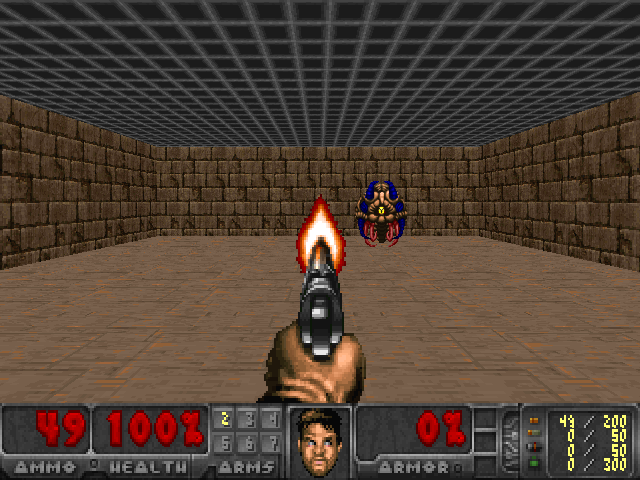
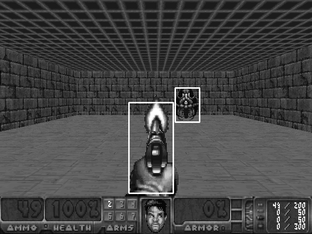

This is a collection of OpenCV scripts. Hope you will find them useful to your projects!  

## Cropping by selecting a rectangle area in an opened image. 
See "cropping.py". 

## Template Matching

So we have an image like this

We'd like to find the monster and the player:

in this image. The script finds the two objects and draws them on the image in rectangles:

See "detect_templates.py".

## Best Template Matching

The monster can move and turn left and turn right. We want to keep track of its positions. 
We can use templates of this monster facing front, left and right:

The script finds the most matching and draws on the image:

See "detect_best_matching_template.py" 

